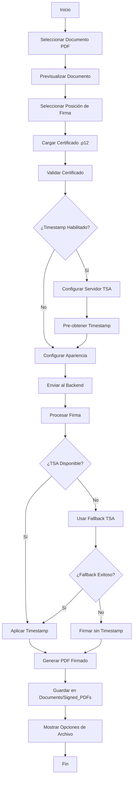
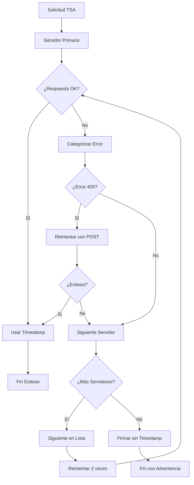
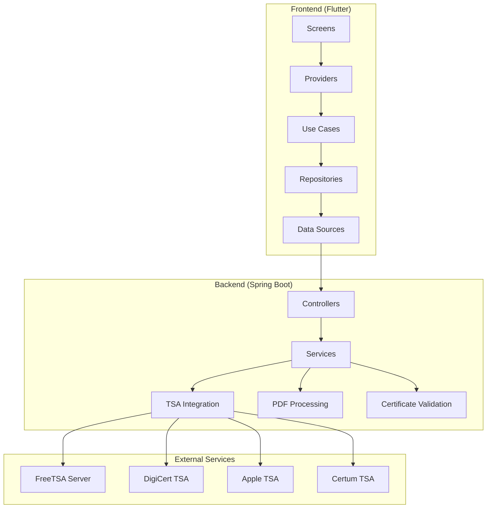
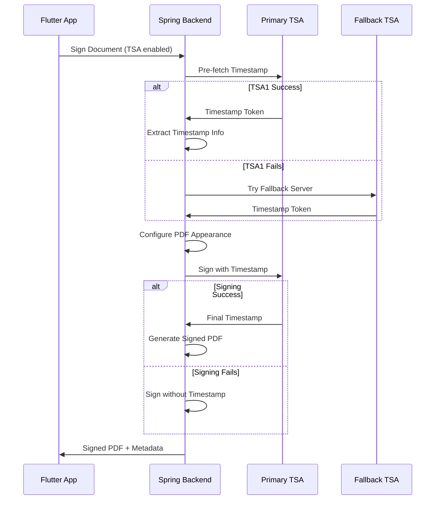

# Firmador - Sistema de Firma Digital

## Descripción del Proyecto

**Firmador** es una aplicación multiplataforma desarrollada en Flutter que permite la firma digital de documentos PDF utilizando certificados digitales (.p12/.pfx). El sistema está compuesto por un frontend móvil/desktop y un backend robusto en Spring Boot que maneja el procesamiento criptográfico y el sellado de tiempo (TSA - Time Stamping Authority).

### Características Principales

- **Firma Digital Segura**: Utiliza certificados digitales PKCS#12 para firmar documentos PDF
- **Sellado de Tiempo Avanzado**: Sistema robusto de timestamp con fallback automático entre múltiples servidores TSA
- **Multiplataforma**: Compatible con iOS, Android, macOS, Windows y Linux
- **Interfaz Intuitiva**: UI moderna con selección visual de posición de firma
- **Validación de Certificados**: Verificación automática de certificados y extracción de información
- **Gestión de Archivos**: Sistema completo de almacenamiento y descarga de documentos firmados

## Arquitectura del Proyecto

### Patrón Arquitectónico: Clean Architecture + Microservicios

```
┌─────────────────────────────────────────────────────────────┐
│                    FRONTEND (Flutter)                      │
├─────────────────────────────────────────────────────────────┤
│  Presentation Layer                                         │
│  ├── Screens (UI)                                          │
│  ├── Widgets (Componentes)                                 │
│  └── Providers (Estado con Riverpod)                       │
├─────────────────────────────────────────────────────────────┤
│  Domain Layer                                               │
│  ├── Entities (Modelos de dominio)                        │
│  ├── Repositories (Contratos)                             │
│  └── Use Cases (Lógica de negocio)                        │
├─────────────────────────────────────────────────────────────┤
│  Data Layer                                                 │
│  ├── Data Sources (API, Local Storage)                    │
│  ├── Models (DTOs)                                        │
│  └── Repositories (Implementaciones)                      │
└─────────────────────────────────────────────────────────────┘
                           │
                    HTTP/REST API
                           │
┌─────────────────────────────────────────────────────────────┐
│                 BACKEND (Spring Boot)                      │
├─────────────────────────────────────────────────────────────┤
│  Controller Layer                                           │
│  └── REST Controllers (Endpoints)                          │
├─────────────────────────────────────────────────────────────┤
│  Service Layer                                              │
│  ├── Digital Signature Service                            │
│  ├── Certificate Service                                  │
│  ├── TSA Service (con fallback)                          │
│  └── Document Storage Service                             │
├─────────────────────────────────────────────────────────────┤
│  Integration Layer                                          │
│  ├── iText PDF Processing                                 │
│  ├── BouncyCastle Cryptography                           │
│  └── Multiple TSA Servers                                │
└─────────────────────────────────────────────────────────────┘
```

## Componentes Principales

### Frontend (Flutter)

#### 1. Presentation Layer
- **`WelcomeScreen`**: Pantalla inicial con selección de modo de firma
- **`BackendSignatureScreen`**: Interfaz principal para firma con servidor
- **`PdfPreviewScreen`**: Visualización y selección de posición de firma
- **`CertificateUploadScreen`**: Gestión de certificados digitales

#### 2. Domain Layer
- **`CertificateInfo`**: Entidad que representa información de certificados
- **`SignaturePosition`**: Entidad para posición de firma en PDF
- **`CryptoRepository`**: Contrato para operaciones criptográficas

#### 3. Data Layer
- **`BackendSignatureService`**: Cliente HTTP para comunicación con backend
- **`UserPreferencesService`**: Gestión de preferencias del usuario
- **`PlatformCryptoRepository`**: Implementación específica por plataforma

### Backend (Spring Boot)

#### 1. Controllers
- **`DigitalSignatureController`**: Endpoints para firma digital y gestión de certificados

#### 2. Services
- **`DigitalSignatureService`**: Lógica principal de firma digital con TSA mejorado
- **`CertificateService`**: Validación y extracción de información de certificados
- **`DocumentStorageService`**: Gestión de almacenamiento de documentos

#### 3. Integrations
- **`TimestampCapturingTSAClient`**: Cliente personalizado para captura de timestamps
- **Sistema de Fallback TSA**: Múltiples servidores con retry automático

## Código Detallado

### Funciones Importantes

#### Frontend

```dart
// Servicio principal de firma con backend
class BackendSignatureService {
  Future<SignatureResult> signDocument({
    required File documentFile,
    required File certificateFile,
    required String signerName,
    // ... otros parámetros
    bool enableTimestamp = false,
    String timestampServerUrl = 'https://freetsa.org/tsr',
  }) async {
    // Implementación con manejo robusto de errores
  }
}

// Gestión de estado con Riverpod
final backendHealthProvider = FutureProvider<bool>((ref) async {
  // Verificación de salud del backend
});
```

#### Backend

```java
// Servicio principal de firma digital
@Service
public class DigitalSignatureService {
    
    // Cliente TSA personalizado que captura información de timestamp
    private static class TimestampCapturingTSAClient implements ITSAClient {
        private final ITSAClient delegate;
        private String timestampInfo;
        
        @Override
        public byte[] getTimeStampToken(byte[] imprint) throws Exception {
            byte[] token = delegate.getTimeStampToken(imprint);
            // Extrae información real del timestamp
            extractTimestampInfo(token);
            return token;
        }
    }
    
    // Sistema de fallback robusto para servidores TSA
    private ITSAClient createTSAClientWithFallback(String primaryUrl) {
        String[] fallbackServers = {
            primaryUrl,
            "https://freetsa.org/tsr",
            "http://timestamp.digicert.com",
            "http://timestamp.apple.com/ts01",
            "http://time.certum.pl",
            "http://timestamp.sectigo.com"
        };
        
        // Implementación con retry automático
        for (String url : fallbackServers) {
            for (int retry = 0; retry < 2; retry++) {
                ITSAClient client = createTSAClient(url);
                if (client != null) return client;
            }
        }
        return null;
    }
}
```

### Variables Importantes

#### Configuración del Sistema TSA

```java
// Servidores TSA con prioridad y confiabilidad
private final String[] TSA_SERVERS = {
    "https://freetsa.org/tsr",           // Más confiable gratuito
    "http://timestamp.digicert.com",     // DigiCert público
    "http://timestamp.apple.com/ts01",   // Apple TSA
    "http://time.certum.pl",            // Certum TSA
    "http://timestamp.sectigo.com"       // Sectigo TSA
};

// Configuración de timeouts y reintentos
private static final int TSA_RETRY_ATTEMPTS = 2;
private static final int TSA_TIMEOUT_SECONDS = 10;
```

#### Estado de la Aplicación Flutter

```dart
// Estado global de la aplicación
class AppState {
  final bool isBackendHealthy;
  final CertificateInfo? certificateInfo;
  final SignaturePosition? signaturePosition;
  final bool enableTimestamp;
  final String selectedTsaServer;
}
```

### Patrones de Diseño

#### 1. Repository Pattern
- **Propósito**: Abstracción de fuentes de datos
- **Implementación**: `CryptoRepository` con implementaciones específicas por plataforma

#### 2. Provider Pattern (Riverpod)
- **Propósito**: Gestión de estado reactivo
- **Implementación**: Providers para estado global y cache

#### 3. Strategy Pattern
- **Propósito**: Diferentes estrategias de firma (local vs servidor)
- **Implementación**: `SignatureStrategy` con implementaciones específicas

#### 4. Decorator Pattern
- **Propósito**: Extensión de funcionalidad TSA
- **Implementación**: `TimestampCapturingTSAClient` envuelve TSA básico

#### 5. Chain of Responsibility
- **Propósito**: Fallback entre servidores TSA
- **Implementación**: Sistema de fallback automático con múltiples servidores

## Flujos Principales

### Flujo de Firma Digital



### Flujo de Fallback TSA



## Instalación

### Requisitos Previos

#### Para Desarrollo
- **Flutter 3.8.1+**
- **Dart 3.0+**
- **Java 17+** (para backend)
- **Maven 3.6+** (para backend)
- **Docker** (opcional, para despliegue)

#### Para Producción
- **Docker** y **Docker Compose**
- **2GB RAM** mínimo para el backend
- **Certificados SSL** (recomendado)

### Pasos de Instalación

#### 1. Clonar Repositorio
```bash
git clone <repository-url>
cd firmador
```

#### 2. Setup Automatizado
```bash
# Dar permisos de ejecución
chmod +x start-dev.sh

# Iniciar todo (backend + frontend)
./start-dev.sh

# Solo backend
./start-dev.sh --skip-frontend

# Solo frontend
./start-dev.sh --skip-backend

# Con Docker
./start-dev.sh --docker
```

#### 3. Setup Manual

##### Backend
```bash
cd backend
mvn clean install
mvn spring-boot:run
```

##### Frontend
```bash
flutter pub get
flutter run
```

## Uso

### Configuración Inicial

#### 1. Verificar Conexión Backend
- Al abrir la aplicación, verificar indicador verde del servidor
- URL por defecto: `http://localhost:8080`

#### 2. Proceso de Firma

1. **Seleccionar Documento**: Elegir archivo PDF
2. **Previsualizar**: Ver documento y navegar páginas
3. **Posición de Firma**: Tocar directamente en el documento
4. **Certificado**: Cargar archivo .p12/.pfx con contraseña
5. **Configurar Timestamp**: Habilitar y seleccionar servidor TSA
6. **Firmar**: Procesar documento

#### 3. Gestión de Archivos Firmados

- **Ubicación**: `Documents/Signed_PDFs/`
- **Opciones**: Abrir, Descargar, Copiar ruta
- **Formatos**: PDF con timestamp visible

### Ejemplos de Uso

#### Firma con Timestamp
```dart
final result = await backendService.signDocument(
  documentFile: pdfFile,
  certificateFile: certFile,
  signerName: 'Juan Pérez',
  location: 'Ecuador',
  reason: 'Firma digital',
  enableTimestamp: true,
  timestampServerUrl: 'https://freetsa.org/tsr',
);
```

#### Configuración de Servidor TSA
```java
// Configuración en application.yml
firmador:
  timestamp:
    primary-server: "https://freetsa.org/tsr"
    fallback-servers:
      - "http://timestamp.digicert.com"
      - "http://timestamp.apple.com/ts01"
    retry-attempts: 2
    timeout-seconds: 10
```

## Estructura del Proyecto

```
firmador/
├── lib/                          # Código Flutter
│   ├── main.dart                 # Punto de entrada
│   └── src/
│       ├── data/                 # Capa de datos
│       │   ├── models/           # DTOs y modelos
│       │   ├── repositories/     # Implementaciones
│       │   └── services/         # Servicios HTTP
│       ├── domain/               # Capa de dominio
│       │   ├── entities/         # Entidades de negocio
│       │   ├── repositories/     # Contratos
│       │   └── usecases/         # Casos de uso
│       └── presentation/         # Capa de presentación
│           ├── providers/        # Estados Riverpod
│           ├── screens/          # Pantallas
│           └── widgets/          # Componentes UI
├── backend/                      # Backend Spring Boot
│   ├── src/main/java/com/firmador/backend/
│   │   ├── controller/           # Controllers REST
│   │   ├── service/              # Servicios de negocio
│   │   ├── dto/                  # DTOs
│   │   └── FirmadorBackendApplication.java
│   ├── src/main/resources/
│   │   ├── application.yml       # Configuración
│   │   └── application-docker.yml
│   ├── Dockerfile                # Imagen Docker
│   ├── docker-compose.yml        # Orquestación
│   └── pom.xml                   # Dependencias Maven
├── doc/                          # Documentación
├── assets/                       # Recursos estáticos
├── android/                      # Configuración Android
├── ios/                          # Configuración iOS
├── macos/                        # Configuración macOS
├── windows/                      # Configuración Windows
├── linux/                        # Configuración Linux
├── web/                          # Configuración Web
└── scripts/                      # Scripts de automatización
    ├── start-dev.sh              # Inicio desarrollo
    ├── start-backend.sh          # Solo backend
    └── cleanup.sh                # Limpieza
```

## Diagramas

### Diagrama de Arquitectura



### Diagrama de Flujo TSA



## API Documentation

### Endpoints Principales

#### POST `/api/signature/sign`
Firma un documento PDF con certificado digital y timestamp opcional.

**Parámetros:**
- `file`: Archivo PDF (multipart)
- `certificate`: Certificado .p12/.pfx (multipart)
- `signerName`: Nombre del firmante
- `location`: Ubicación de firma
- `reason`: Razón de la firma
- `enableTimestamp`: Habilitar timestamp (boolean)
- `timestampServerUrl`: URL del servidor TSA

**Respuesta:**
- **200**: PDF firmado (bytes)
- **400**: Error de validación
- **500**: Error interno

#### POST `/api/signature/certificate-info`
Extrae información de un certificado digital.

**Respuesta:**
```json
{
  "success": true,
  "certificateInfo": {
    "subject": "CN=Juan Pérez, O=Empresa",
    "issuer": "CN=CA Root",
    "validFrom": "2024-01-01T00:00:00Z",
    "validTo": "2025-12-31T23:59:59Z",
    "commonName": "Juan Pérez"
  }
}
```

#### GET `/api/signature/health`
Verifica el estado del servidor.

**Respuesta:**
```json
{
  "status": "OK",
  "timestamp": 1640995200000,
  "message": "Firmador Backend is running"
}
```

## Información de Pruebas

### Estrategia de Pruebas

#### 1. Pruebas Unitarias
- **Backend**: JUnit 5 para servicios y controladores
- **Frontend**: Flutter Test para lógica de negocio

#### 2. Pruebas de Integración
- **API**: Postman/Newman para endpoints
- **TSA**: Verificación de múltiples servidores

#### 3. Pruebas de UI
- **Flutter**: Integration tests para flujos principales
- **Multiplataforma**: Verificación en iOS, Android, Desktop

### Ejecutar Pruebas

```bash
# Backend
cd backend
mvn test

# Frontend
flutter test

# Integración
flutter drive --target=test_driver/app.dart
```

### Casos de Prueba Críticos

1. **Firma con Timestamp**: Verificar timestamp real en PDF
2. **Fallback TSA**: Probar fallo de servidor primario
3. **Certificados**: Validación de múltiples formatos
4. **Multiplataforma**: Funcionamiento en todas las plataformas
5. **Errores**: Manejo robusto de errores de red y TSA

## Contribución

### Flujo de Desarrollo

1. **Fork** del repositorio
2. **Crear rama** feature: `git checkout -b feature/nueva-funcionalidad`
3. **Desarrollar** siguiendo patrones establecidos
4. **Probar** localmente con `./start-dev.sh`
5. **Commit** con emoji 🤖 y mensaje descriptivo
6. **Push** y crear **Pull Request**

### Estándares de Código

- **Dart**: Seguir [Effective Dart](https://dart.dev/guides/language/effective-dart)
- **Java**: Seguir [Google Java Style](https://google.github.io/styleguide/javaguide.html)
- **Commits**: Formato convencional con emoji 🤖
- **Documentación**: Actualizar con cada cambio significativo

### Áreas de Contribución

- **Nuevos Servidores TSA**: Agregar más opciones confiables
- **Mejoras UI/UX**: Optimizaciones de interfaz
- **Soporte Plataformas**: Mejorar compatibilidad
- **Seguridad**: Auditorías y mejoras criptográficas
- **Performance**: Optimizaciones de rendimiento

## Licencia

Este proyecto está bajo la **Licencia MIT**. Ver archivo `LICENSE` para más detalles.

### Términos de Uso

- **Uso comercial**: Permitido
- **Modificación**: Permitida
- **Distribución**: Permitida
- **Uso privado**: Permitido
- **Responsabilidad**: Limitada

### Dependencias de Terceros

- **iText**: AGPL/Commercial (procesamiento PDF)
- **BouncyCastle**: MIT (criptografía)
- **Flutter**: BSD-3-Clause (framework)
- **Spring Boot**: Apache 2.0 (backend)

---

**Versión de Documentación**: 2.0.0  
**Última Actualización**: Enero 2025  
**Autor**: Equipo Firmador  
**Contacto**: [Información de contacto] 