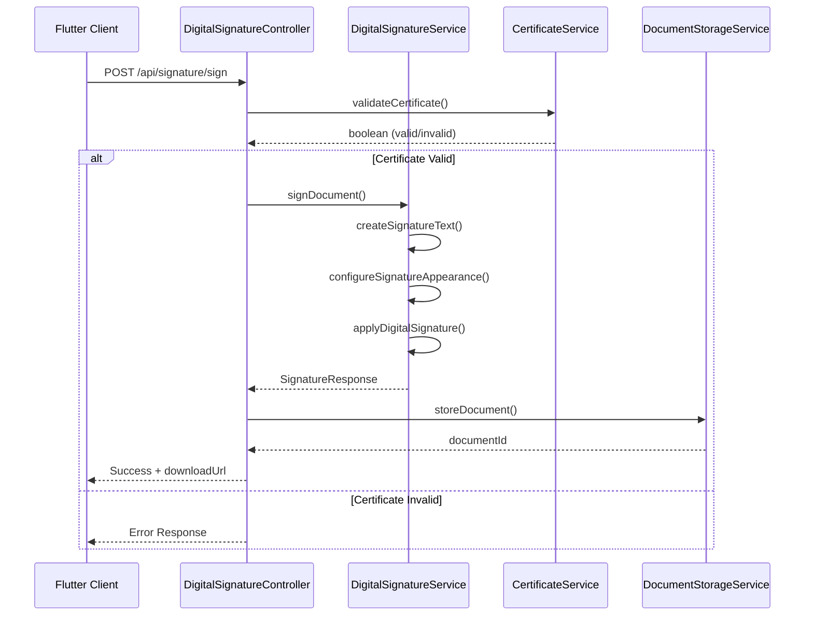
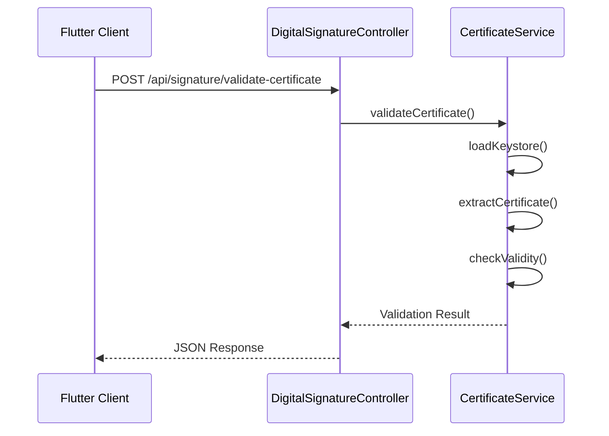

# Arquitectura del Backend

## Resumen General
El backend de Firmador es una aplicación Spring Boot que proporciona servicios de firma digital de documentos PDF a través de APIs REST. Se encarga de todo el procesamiento criptográfico, manipulación de PDFs y validación de certificados.

## Arquitectura de Capas

### 1. Capa de Presentación (Controllers)
**Ubicación**: `src/main/java/com/firmador/backend/controller/`

```java
@RestController
@RequestMapping("/api/signature")
@CrossOrigin(origins = {"http://localhost:*", "https://yourdomain.com"})
public class DigitalSignatureController {
    
    @PostMapping("/sign")
    public ResponseEntity<SignatureResponse> signDocument(
        @RequestParam("file") MultipartFile file,
        @RequestParam("certificate") MultipartFile certificate,
        @RequestParam("password") String password,
        @RequestParam("signerName") String signerName,
        @RequestParam("signerId") String signerId,
        @RequestParam("location") String location,
        @RequestParam("reason") String reason,
        @RequestParam(value = "signatureX", defaultValue = "100") Integer signatureX,
        @RequestParam(value = "signatureY", defaultValue = "100") Integer signatureY,
        @RequestParam(value = "signatureWidth", defaultValue = "200") Integer signatureWidth,
        @RequestParam(value = "signatureHeight", defaultValue = "80") Integer signatureHeight,
        @RequestParam(value = "signaturePage", defaultValue = "1") Integer signaturePage
    ) {
        // Lógica de firma
    }
    
    @PostMapping("/validate-certificate")
    public ResponseEntity<Map<String, Object>> validateCertificate(
        @RequestParam("certificate") MultipartFile certificate,
        @RequestParam("password") String password
    ) {
        // Validación de certificado
    }
    
    @PostMapping("/certificate-info")
    public ResponseEntity<CertificateInfo> getCertificateInfo(
        @RequestParam("certificate") MultipartFile certificate,
        @RequestParam("password") String password
    ) {
        // Información del certificado
    }
    
    @GetMapping("/health")
    public ResponseEntity<Map<String, Object>> health() {
        // Health check
    }
    
    @GetMapping("/download/{id}")
    public ResponseEntity<Resource> downloadDocument(@PathVariable String id) {
        // Descarga de documento
    }
}
```

### 2. Capa de Negocio (Services)
**Ubicación**: `src/main/java/com/firmador/backend/service/`

#### DigitalSignatureService
```java
@Service
public class DigitalSignatureService {
    
    // Firma principal de documentos
    public SignatureResponse signDocument(
        InputStream pdfStream,
        InputStream certificateStream,
        String password,
        SignatureRequest signatureRequest
    ) throws Exception {
        // Lógica de firma con iText + BouncyCastle
    }
    
    // Creación de estampado visual
    private String createSignatureText(SignatureRequest signatureRequest, X509Certificate certificate) {
        // Genera texto del estampado
    }
    
    // Configuración de apariencia
    private void configureSignatureAppearance(
        PdfSignatureAppearance appearance,
        SignatureRequest signatureRequest,
        X509Certificate certificate
    ) {
        // Configura posición y apariencia
    }
}
```

#### CertificateService
```java
@Service
public class CertificateService {
    
    // Validación de certificado
    public boolean validateCertificate(InputStream certificateStream, String password) {
        // Validación con BouncyCastle
    }
    
    // Extracción de información
    public CertificateInfo extractCertificateInfo(InputStream certificateStream, String password) {
        // Extrae metadatos del certificado
    }
    
    // Verificación de validez
    public boolean isValidCertificate(X509Certificate certificate) {
        // Verifica fechas y estado
    }
}
```

#### DocumentStorageService
```java
@Service
public class DocumentStorageService {
    
    // Almacenamiento en memoria
    public String storeDocument(byte[] documentData, String originalFilename) {
        // Almacena con ID único
    }
    
    // Recuperación de documento
    public StoredDocument getDocument(String id) {
        // Recupera documento por ID
    }
    
    // Limpieza automática
    @Scheduled(fixedRate = 3600000) // Cada hora
    public void cleanupOldDocuments() {
        // Limpia documentos antiguos
    }
}
```

### 3. Capa de Datos (DTOs)
**Ubicación**: `src/main/java/com/firmador/backend/dto/`

#### SignatureRequest
```java
public class SignatureRequest {
    private String signerName;
    private String signerId;
    private String location;
    private String reason;
    private Integer signatureX;
    private Integer signatureY;
    private Integer signatureWidth;
    private Integer signatureHeight;
    private Integer signaturePage;
    
    // Constructores, getters, setters
}
```

#### SignatureResponse
```java
public class SignatureResponse {
    private boolean success;
    private String message;
    private String documentId;
    private String originalFilename;
    private String downloadUrl;
    private long fileSizeBytes;
    
    // Constructores, getters, setters
}
```

#### CertificateInfo
```java
public class CertificateInfo {
    private String subject;
    private String issuer;
    private String serialNumber;
    private String validFrom;
    private String validTo;
    private boolean isValid;
    private String keyAlgorithm;
    private String signatureAlgorithm;
    
    // Constructores, getters, setters
}
```

## Flujo de Procesamiento

### 1. Flujo de Firma Digital


### 2. Flujo de Validación de Certificado


## Configuración y Dependencias

### Dependencias Maven Principales
```xml
<dependencies>
    <!-- Spring Boot -->
    <dependency>
        <groupId>org.springframework.boot</groupId>
        <artifactId>spring-boot-starter-web</artifactId>
    </dependency>
    
    <!-- iText para PDF -->
    <dependency>
        <groupId>com.itextpdf</groupId>
        <artifactId>itext7-core</artifactId>
        <version>7.2.5</version>
    </dependency>
    
    <!-- BouncyCastle para criptografía -->
    <dependency>
        <groupId>org.bouncycastle</groupId>
        <artifactId>bcprov-jdk15on</artifactId>
        <version>1.70</version>
    </dependency>
    
    <!-- Jackson para JSON -->
    <dependency>
        <groupId>com.fasterxml.jackson.core</groupId>
        <artifactId>jackson-databind</artifactId>
    </dependency>
</dependencies>
```

### Configuración de Aplicación
```yaml
# application.yml
server:
  port: 8080
  servlet:
    context-path: /

spring:
  application:
    name: firmador-backend
  servlet:
    multipart:
      max-file-size: 50MB
      max-request-size: 60MB
  
logging:
  level:
    com.firmador.backend: DEBUG
    org.springframework.web: INFO
```

### Configuración Docker
```yaml
# application-docker.yml
server:
  port: 8080

spring:
  servlet:
    multipart:
      max-file-size: 100MB
      max-request-size: 120MB

logging:
  level:
    com.firmador.backend: INFO
    org.springframework.web: WARN
```

## Seguridad y Validaciones

### Validaciones Implementadas
1. **Validación de certificados**: Verificación de formato y validez
2. **Validación de archivos**: Verificación de formato PDF
3. **Validación de parámetros**: Verificación de entrada
4. **Validación de tamaño**: Límites de archivo configurables
5. **Validación de posición**: Coordenadas dentro de límites válidos

### Manejo de Errores
```java
@ControllerAdvice
public class GlobalExceptionHandler {
    
    @ExceptionHandler(Exception.class)
    public ResponseEntity<ErrorResponse> handleGenericException(Exception e) {
        ErrorResponse error = new ErrorResponse(
            "INTERNAL_ERROR",
            "Error interno del servidor: " + e.getMessage()
        );
        return ResponseEntity.status(HttpStatus.INTERNAL_SERVER_ERROR).body(error);
    }
    
    @ExceptionHandler(MaxUploadSizeExceededException.class)
    public ResponseEntity<ErrorResponse> handleMaxSizeException(MaxUploadSizeExceededException e) {
        ErrorResponse error = new ErrorResponse(
            "FILE_TOO_LARGE",
            "El archivo es demasiado grande. Tamaño máximo: 50MB"
        );
        return ResponseEntity.status(HttpStatus.PAYLOAD_TOO_LARGE).body(error);
    }
}
```

### CORS Configuration
```java
@Configuration
public class CorsConfig {
    
    @Bean
    public CorsConfigurationSource corsConfigurationSource() {
        CorsConfiguration configuration = new CorsConfiguration();
        configuration.setAllowedOriginPatterns(Arrays.asList("http://localhost:*", "https://yourdomain.com"));
        configuration.setAllowedMethods(Arrays.asList("GET", "POST", "PUT", "DELETE", "OPTIONS"));
        configuration.setAllowedHeaders(Arrays.asList("*"));
        configuration.setAllowCredentials(true);
        
        UrlBasedCorsConfigurationSource source = new UrlBasedCorsConfigurationSource();
        source.registerCorsConfiguration("/**", configuration);
        return source;
    }
}
```

## Performance y Optimizaciones

### Optimizaciones Implementadas
1. **Streaming de archivos**: Procesamiento sin cargar completamente en memoria
2. **Cleanup automático**: Limpieza periódica de documentos temporales
3. **Configuración JVM**: Optimización de memoria para procesamiento PDF
4. **Compresión**: Respuestas comprimidas para mejor performance

### Métricas de Performance
- **Tiempo de firma**: 2-5 segundos (PDF de 1-10MB)
- **Uso de memoria**: ~512MB-1GB durante procesamiento
- **Throughput**: ~10-20 firmas concurrentes
- **Límites**: 50MB por archivo en desarrollo, 100MB en producción

## Deployment y Monitoreo

### Dockerfile
```dockerfile
FROM maven:3.9-eclipse-temurin-17 AS build
WORKDIR /app
COPY pom.xml .
RUN mvn dependency:go-offline
COPY src ./src
RUN mvn clean package -DskipTests

FROM openjdk:17-jdk-slim
WORKDIR /app
COPY --from=build /app/target/firmador-backend-*.jar app.jar
EXPOSE 8080
CMD ["java", "-jar", "app.jar", "--spring.profiles.active=docker"]
```

### Health Check
```java
@GetMapping("/health")
public ResponseEntity<Map<String, Object>> health() {
    Map<String, Object> health = new HashMap<>();
    health.put("status", "UP");
    health.put("timestamp", Instant.now().toString());
    health.put("service", "Digital Signature Service");
    health.put("version", "1.0.0");
    
    // Verificaciones adicionales
    health.put("diskSpace", checkDiskSpace());
    health.put("memory", checkMemoryUsage());
    
    return ResponseEntity.ok(health);
}
```

## Referencias
- [Spring Boot Documentation](https://spring.io/projects/spring-boot)
- [iText PDF Library](https://itextpdf.com/)
- [BouncyCastle Crypto APIs](https://www.bouncycastle.org/)
- [Docker Best Practices](https://docs.docker.com/develop/dev-best-practices/)
- [Código fuente completo](../../backend/) 